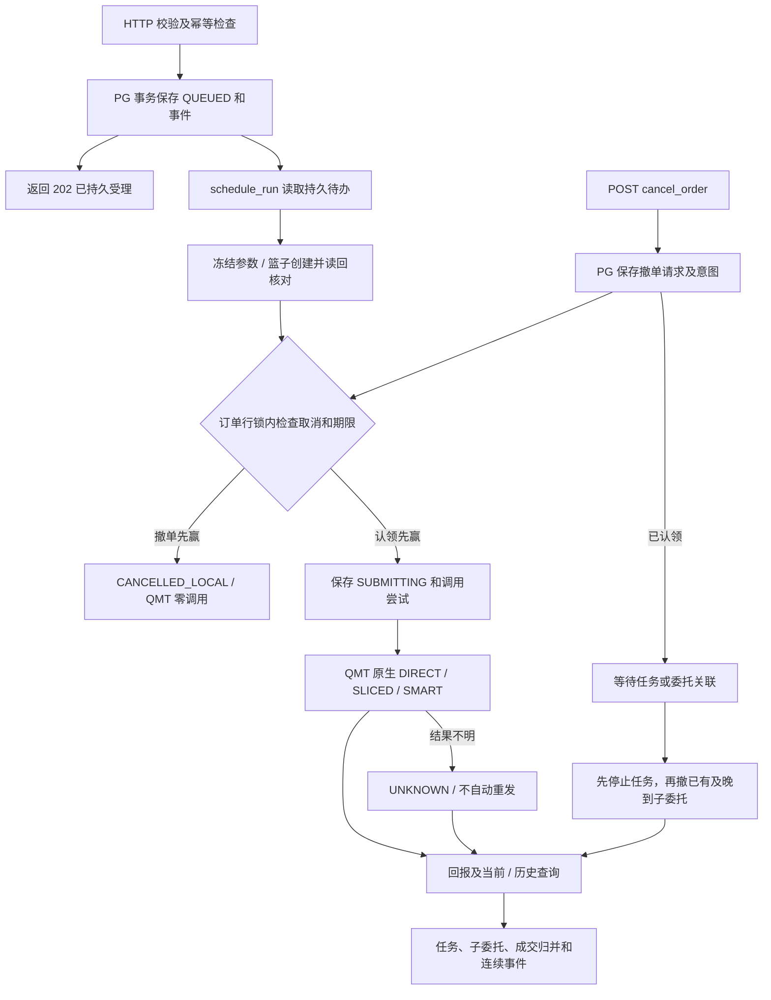

# ORDER 设计与验收边界

## 责任与部署

`order_bridge/*.py` 是 UTF-8 开发源码。`python tools/build_order_strategy.py` 按 common、contracts、state、repository、qmt、runtime、http 顺序生成 `strategies/http_order.py`，交给 QMT 的是单份 GBK 文件。`--check` 仅检查是否与源码一致，忽略生成时间。策略不依赖运行时可导入 `order_bridge` 包，但 QMT Python 环境需要 PostgreSQL 驱动。`tools/install_order_dependencies.py` 默认把锁定的 wheel 装到 `%USERPROFILE%\qmt-bridge\vendor`，支持 `--wheel-dir` 离线安装与 `--python36` 目标兼容选择；不修改系统 site-packages。

配置通过 pg_database 选择 PostgreSQL 数据库；模拟盘与实盘使用不同数据库，每个库内部固定 qmt_order schema，不提供 pg_schema 配置。表不另加 `namespace_id` 或 `broker_environment_id`。账户类型目前固定 `STOCK`，策略绑定一个账户；HTTP 回环端口仅是监听端口，不代表交易环境或访问隔离。DDL 唯一存放在 sql/order_v1.sql。tools/order_admin.py schema init 显式读取 SQL 文件安装并注册账户；生成的策略不包含安装工具或 DDL。策略启动只检查既有关键表、字段、版本及账户记录，成功后才接收写请求。

## 合同与 QMT 映射

原有 `GET/POST /account`、`/positions`、`/get_smart_algo_param` 保持原查询合同和直接返回值。写命令只有 `POST /submit_order` 与 `POST /cancel_order`；查询为 `GET /order`、`/orders`、`/order_events`、`/capabilities`、`/health`。新命令错误沿用 `{"error":{"code":"...","message":"..."}}`。受理成功的 `202` 只证明 PostgreSQL 事务提交，不证明 QMT 接受或成交。

下单以 `(account_type, account_id, client_order_id)` 持久去重；撤单以 `(account_type, account_id, cancel_request_id)` 持久去重。同键相同标准化内容重放返回原记录；同键不同内容报冲突。HTTP 响应丢失后，调用方用原幂等键重试并查询 `order_id`。单票 `SINGLE` 必须指定 `symbol`、`side`（BUY/SELL）和 `sizing_type`（QUANTITY/AMOUNT）；`quantity` 与 `amount` 恰好选一且与 sizing_type 一致。数量单位为股/ETF 份，不自动乘 100；金额为人民币十进制字符串，当前仅股票单票可用。`strategy_id` 是可选非空字符串。篮子 `BASKET` 的 sizing_type 仅为 QUANTITY，由非空 `items` 组成，每项含唯一 `item_id`、证券、方向、正整数数量。合同目前拒绝相同证券/方向重复项；这只是 bridge 的输入限制，不是推断的交易所规则。

`LIMIT` 需要十进制字符串 `limit_price`，当前仅单票。`QUOTE` 需要 `quote_type`，可选 LATEST、OWN_BEST、OPPONENT_BEST、FAR_LIMIT；SMART 不支持 QUOTE。`MARKET` 在 DIRECT/SLICED 中需要交易所适用的业务枚举 `market_type`，不暴露 QMT 数字代码；沪市/北交所还需 `protection_price`，MARKET 篮子仅允许 SMART。执行配置是 `execution` 对象，其 `type` 为 DIRECT、SLICED 或 SMART。三条 QMT 原生路线为 `DIRECT → passorder`、`SLICED → algo_passorder`、`SMART → smart_algo_passorder`，都支持单票与原生篮子。篮子调用前使用该单唯一 `basket_name` 写入 QMT 并读回比对，不拆成单票。SMART 用 `get_smart_algo_param` 元数据补齐并校验参数；SLICED 要求完整显式配置，避免读取本机面板隐含值。实际适用性由 `/capabilities` 的本机 API 可用性和模拟盘验收决定。

## 状态、取消与恢复

订单 JSON 文档是权威状态；关系投影与事件由同一 PostgreSQL 事务更新。提交前写 `QUEUED`，调度器认领后进入提交过程。QMT 同步返回、委托回报、任务状态、成交回报和主动查询是不同证据；任何单一提交 API 返回都不等于成交。订单保留任务、委托、成交及每个篮子 item 的关联标识。重复或乱序回报以持久标识去重/合并，并在事件中标明来源和时间。`UNKNOWN` 表示提交结果无法判定，仅冻结这一订单的再次提交与取消判定，不停止其他订单。

取消包含三种竞态：

1. 订单仍在队列且 QMT 调用未开始：持久取消意图可以阻止提交；不能把它报告成 QMT 已撤单。
2. QMT 调用已开始、尚无任务/委托号：保留取消意图；获得标识或对账后再处理，不盲目重下原单。
3. 已有委托但成交与撤单交错：只对未成交余量发撤单；继续吸收成交和撤单回报，展示已成交、剩余和各子委托结果。全部成交时取消可结束为无余量可撤，原订单仍是已成交。

HTTP 线程可以校验和持久受理，所有 QMT API 都只能从 `schedule_run` 回调触发。重启恢复未执行命令与取消意图；崩溃于 `SUBMITTING` 的订单须先与 QMT 记录核对，不能盲目重放。执行器同一数据库/账户只能有一个活跃实例；失锁或互斥异常时冻结副作用，恢复须重新获取锁并对账。`stop` 停止 bridge 和待处理 HTTP 请求，不自动撤销 QMT 中的订单或算法任务。

`tools/order_admin.py unknown` 是离线管理入口，绝不直接调用 QMT。`list/inspect` 读取持久记录与同账户候选观察；`reconcile` 仅写入 `reconcile_requested` 供调度器查询。`resolve` 要求 `--expected-version`、理由和证据文件，事务内校验版本，并保存操作者、证据内容/hash、前后状态。`observed` 只能从已采集的原始 QMT 观察记录中选择；事务内核对账户、证券、方向、remark、任务/委托标识及是否已关联其他订单。观察原文不修改；缺 remark 时必须有明确指向订单和观察 ID 的人工归属凭据。`not-submitted` 要有能证明 QMT 调用没有发生的正面证据及明确声明；查询无记录、超时、回调缺失均不足以证明。人工处置不把旧订单重新变为 `QUEUED`。证据不足时继续保持 `UNKNOWN`。

## 验收

自动测试覆盖老查询兼容、合同参数、持久幂等、断连/超时、提交崩溃恢复、三类取消竞态、部分成交、`UNKNOWN` 单单冻结及三路线单票/篮子的 QMT 模拟函数调用。另需隔离 PostgreSQL 集成测试，验证 schema 初始化、事务、重启与并发；不得使用 TradeNest 数据库。最后在模拟盘逐条检验 DIRECT/SLICED/SMART 的单票与篮子路径，包括 remark、父任务、子委托、成交和撤单关联。代码测试通过不代表完成 QMT 实盘或模拟盘交易验收。
