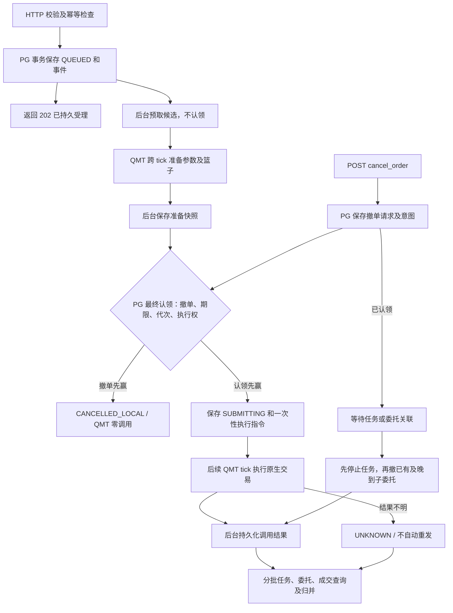

# ORDER 设计与验收边界

## 责任与部署

`order_bridge/*.py` 是 UTF-8 开发源码。`python tools/build_order_strategy.py` 按 common、contracts、state、repository、qmt、async_log、background、runtime、http 顺序生成 `strategies/http_order.py`，交给 QMT 的是单份 GBK 文件。`--check` 仅检查是否与源码一致，忽略生成时间。策略不依赖运行时可导入 `order_bridge` 包，但 QMT Python 环境需要 PostgreSQL 驱动。`tools/install_order_dependencies.py` 默认把锁定的 wheel 装到 `%USERPROFILE%\qmt-bridge\vendor`，支持 `--wheel-dir` 离线安装与 `--python36` 目标兼容选择；不修改系统 site-packages。

配置通过 `pg_database` 选择 PostgreSQL 数据库；模拟盘与实盘使用不同数据库，每个库内部固定 `qmt_order` schema，不提供 `pg_schema` 配置。表不另加 `namespace_id` 或 `broker_environment_id`。账户类型目前固定 `STOCK`，策略绑定一个账户；HTTP 回环端口仅是监听端口，不代表交易环境或访问隔离。初始化 DDL 统一在 `sql/order_init.sql`，不创建外键，保留主键、幂等唯一约束和索引。开发阶段只维护当前结构，不提供历史版本升级。`tools/order_admin.py schema init` 初始化全新或兼容当前结构的库，`schema check` 只读；两个命令只需数据库配置，不要求账户 ID。`unknown` 人工管理命令仍须指定账户。生成的策略不包含安装工具或 DDL，也不自动变更业务库结构。

后台启动先检查既有关键表、字段及当前结构版本，再按配置的账户 ID 幂等插入缺失的 `account_runtime` 行；已有行的 `event_seq`、执行主机和代次保持原值。当前结构版本标识仍为 2，与既有数据库兼容；初始化遇到不兼容版本会在执行 DDL 前拒绝，不自动重建或删除数据。运行时只读写业务状态，不执行 DDL。固定 schema 和按账户动态补行互不冲突。

QMT 面板在启动时读取并冻结 `submit_batch_size=10`、`cancel_batch_size=10`、`reconcile_batch_size=100`、`schedule_budget_ms=50`、`reconcile_interval_seconds=30`；小写优先，兼容大写，非法值启动失败。提交上限按业务订单计，篮子算一笔；撤单上限按实际 QMT 任务/子委托动作计；对账上限按进入该批的业务订单计；预算从 `process_http_requests` 入口覆盖整个回调。数量只是上限，剩余工作跨 tick 继续；已开始的同步 QMT 调用不能强制中断。

## 合同与 QMT 映射

原有 `GET/POST /account`、`/positions`、`/get_smart_algo_param` 保持原查询合同和直接返回值。写命令只有 `POST /submit_order` 与 `POST /cancel_order`；查询为 `GET /order`、`/orders`、`/order_events`、`/capabilities`、`/health`。新命令错误沿用 `{"error":{"code":"...","message":"..."}}`。受理成功的 `202` 只证明 PostgreSQL 事务提交，不证明 QMT 接受或成交。

下单以 `(account_type, account_id, client_order_id)` 持久去重；撤单以 `(account_type, account_id, cancel_request_id)` 持久去重。同键相同标准化内容重放返回原记录；同键不同内容报冲突。HTTP 响应丢失后，调用方用原幂等键重试并查询 `order_id`。单票 `SINGLE` 必须指定 `symbol`、`side`（BUY/SELL）和 `sizing_type`（QUANTITY/AMOUNT）；`quantity` 与 `amount` 恰好选一且与 sizing_type 一致。数量单位为股/ETF 份，不自动乘 100；金额为人民币十进制字符串，当前仅股票单票可用。`strategy_id` 是可选非空字符串。篮子 `BASKET` 的 sizing_type 仅为 QUANTITY，由非空 `items` 组成，每项含唯一 `item_id`、证券、方向、正整数数量。合同目前拒绝相同证券/方向重复项；这只是 bridge 的输入限制，不是推断的交易所规则。

`LIMIT` 需要十进制字符串 `limit_price`，当前仅单票。`QUOTE` 需要 `quote_type`，可选 LATEST、OWN_BEST、OPPONENT_BEST、FAR_LIMIT；SMART 不支持 QUOTE。`MARKET` 在 DIRECT/SLICED 中需要交易所适用的业务枚举 `market_type`，不暴露 QMT 数字代码；沪市/北交所还需 `protection_price`，MARKET 篮子仅允许 SMART。执行配置是 `execution` 对象，其 `type` 为 DIRECT、SLICED 或 SMART。三条 QMT 原生路线为 `DIRECT → passorder`、`SLICED → algo_passorder`、`SMART → smart_algo_passorder`，都支持单票与原生篮子。篮子调用前使用该单唯一 `basket_name` 写入 QMT 并读回比对，不拆成单票。SMART 用 `get_smart_algo_param` 元数据补齐并校验参数；SLICED 要求完整显式配置，避免读取本机面板隐含值。实际适用性由 `/capabilities` 的本机 API 可用性和模拟盘验收决定。

## 状态、取消与恢复

订单 JSON 文档是权威状态；关系投影与事件由同一 PostgreSQL 事务更新。`orders` 的 `submission_status`、`cancel_ready`、`reconcile_pending`、`reconcile_priority`、`reconcile_due_at`、最近对账时间、`fact_version` 和 `created_at` 支持有界候选扫描。预取不改变 `QUEUED`；参数读取和篮子写后读回可跨 tick，准备快照落库后才最终认领。认领再次核对撤单、期限、实例代次及执行权；指令带尝试 ID 和实例代次，只消费一次。调用结果未落库不再次派发，崩溃后先归入 `UNKNOWN` 再核对。QMT 同步返回、委托回报、任务状态、成交回报和主动查询是不同证据；任何单一提交 API 返回都不等于成交。订单保留任务、委托、成交及每个篮子 item 的关联标识。重复或乱序回报以持久标识去重/合并，并在事件中标明来源和时间。`UNKNOWN` 仅冻结该订单的盲目重发，其他订单可继续执行。

运行检查点与业务事件分开保存：常规对账开始/结束只更新订单中的轮次、时间和门闩，并写 INFO 日志，不追加 `order_events` 或重写子表。完成对账时比较排除运行字段后的状态；真实业务或同步状态改变才追加 `RECONCILE_STATE_CHANGED`，并在同一事务中更新相关投影。`version` 继续随持久保存增加，以维持人工处置的并发校验；`event_seq` 只随真实事件增加。`order_events` 供增量查询和追溯，恢复不回放它；既有事件保留，不自动归档或清理。

取消包含三种竞态：

1. 订单仍在队列且 QMT 调用未开始：持久取消意图可以阻止提交；不能把它报告成 QMT 已撤单。
2. QMT 调用已开始、尚无任务/委托号：保留取消意图；获得标识或对账后再处理，不盲目重下原单。
3. 已有委托但成交与撤单交错：只对未成交余量发撤单；继续吸收成交和撤单回报，展示已成交、剩余和各子委托结果。全部成交时取消可结束为无余量可撤，原订单仍是已成交。

HTTP 线程负责参数校验、持久受理、幂等和订单数据库查询，允许等待自己的事务；只有事务提交确认后才返回 202。数据库后台线程读取候选、认领、保存调用结果、归并回报并执行恢复。执行权后台线程用专用连接持有 PostgreSQL advisory lock，定期核验并发放短期授权；HTTP/QMT 线程不共享该连接。QMT 调度线程仅执行下单、撤单、交易查询、SMART 参数、篮子操作和原生对象快照，不执行 SQL、等待数据库结果或持有跨 I/O 的共享锁。线程间传递有界普通数据队列；交易前预留结果缓冲容量，未落库结果保留，数据库故障暂停新调用。回报溢出记录缺口，随后按时间范围补查。日志后台线程按上海时区异步写 console 和每日文件；满队列记录丢弃数，不让 QMT 线程同步补写。

QMT 侧检查停止标志、实例代次及短期授权。授权过期、失权或数据库异常时暂停交易，不无限复用缓存；PG 与 QMT 不构成原子提交。重启先扫描未执行命令、取消意图及回报缺口；崩溃于 `SUBMITTING` 的订单先与 QMT 记录核对，不能盲目重放。执行器同一数据库/账户只能有一个活跃实例。撤单优先，但提交、对账和旧查询通过跨 tick 轮转获得服务机会；`WAITING_QMT_ID` 不占据可执行撤单候选首页，大篮子的撤单动作按配额拆开。

`reconcile_pending` 与订单是否交易中、一次查询是否覆盖完整是不同概念。提交结果不明、执行中、部分成交、进入过 QMT 且取消未决的订单继续对账；确定没有 QMT 调用的本地取消、提交前过期和明确未创建任务/委托的拒绝单无需对账。终态订单只有在任务不再产生子委托、所有相关子委托结束、成交明细与累计量一致、查询覆盖完整且没有待关联证据或未决撤单时退出；撤单 `REJECTED` 不能单独结束父单。迟到的新事实或缺口在同一事务重开 pending，重复回报不反复唤醒；旧对账轮通过 `fact_version` 检查，不能清除期间出现的新事实。后台每批最多纳入 100 笔业务订单，按最久未尝试稳定轮转，同轮账户级 QMT 快照供多个业务批次复用。原生 QMT 查询与快照转换可能超过单次 50ms 预算。

早期委托回报可能尚无 `m_strOrderSysID`，随后才补齐。对于这种 `MISSING_QMT_ID`，归并器只在显式账户、交易日、市场，以及 `m_nRef`、`m_strOrderRef` 两项原生引用均一致、候选唯一且其他身份不冲突时解除关联缺口。原始证据移入 `resolved_evidence` 并保留关联目标和依据，原始 `qmt_observations` 不删除。仅凭证券、数量、备注或任务号不自动匹配；成交累计量尚未被已知委托覆盖时仍保留缺口。恢复旧文档同样执行核对，无需重建表或手工删除证据；身份修复后仍须完成完整对账才能退出 pending。

账户对账首轮立即执行；后续每轮结束后以单调时钟等待 `reconcile_interval_seconds`，失败同样等待，且不与 `last_reconciled_at` 的成功时间绑定。该间隔同时用于逐单选中和归并后的持久 `reconcile_due_at`。对账等待不阻塞命令派发或回报归并，轮次仍不重叠。QMT 查询/回调失败记录异常类型、正文和有界堆栈；只读取 traceback 元数据，不在 QMT 线程查源码文件或局部变量。查询失败不伪造成空结果，也不写成成功事实。

后台初始化、账户补行、执行权取得和恢复期间，`lifecycle` 为 `STARTING` 或 `RECOVERING`，不接受新订单；未配置 PG 仍保留旧查询模式。运行中 `/health` 缓存采样时间、后台状态、`pending_count`、`unknown_order_count`、队列积压/溢出、最近完整对账、tick/QMT 耗时及授权剩余时间，HTTP 层附 `schedule_settings`、`scheduler`、`logging`。对账诊断另区分最近尝试、最近结束、下次轮次时间和最近查询异常摘要；失败不更新成功时间，HTTP 不返回堆栈。`accepting_orders` 需恢复完成、数据库和短期授权有效且调度存活。`stop` 先关闭受理/派发并取消定时任务，QMT 回调只发停止信号；后台等待在途工作收尾后释放连接、本机锁和日志资源，完成前维持 `STOPPING`。停止 bridge 不自动撤销 QMT 中的订单或算法任务。

`tools/order_admin.py unknown` 是离线管理入口，绝不直接调用 QMT。`list/inspect` 读取持久记录与同账户候选观察；`reconcile` 仅写入 `reconcile_requested` 供调度器查询。`resolve` 要求 `--expected-version`、理由和证据文件，事务内校验版本，并保存操作者、证据内容/hash、前后状态。`observed` 只能从已采集的原始 QMT 观察记录中选择；事务内核对账户、证券、方向、remark、任务/委托标识及是否已关联其他订单。观察原文不修改；缺 remark 时必须有明确指向订单和观察 ID 的人工归属凭据。`not-submitted` 要有能证明 QMT 调用没有发生的正面证据及明确声明；查询无记录、超时、回调缺失均不足以证明。人工处置不把旧订单重新变为 `QUEUED`。证据不足时继续保持 `UNKNOWN`。

## 验收

原生对象快照在读取属性前排除已知不可转换的内部字段 `m_xtTag`，其他字段转换失败仍阻断该快照，不能用部分数据完成对账。错误诊断保存有界可读值及字段错误，首次成功排除内部属性写一次警告；诊断和业务事实分离，原生对象不传给后台日志线程。

主动 QMT 调用统一经过 `qmt_invoke`，INFO 记录调用前、原始返回后或异常，并以 `qmt_call_id` 关联。参数为有界普通值快照；返回仅记录标量值或集合条数，不为日志遍历原生属性。执行器将持久化尝试 ID、业务订单和撤单 ID 附加到该次调用，离开指令时恢复上下文，避免串单。日志故障不改变返回值、异常或引发重发；账户绑定、定时器及旧查询也采用同一入口。

自动测试覆盖老查询兼容、合同参数、持久幂等、断连/超时、提交崩溃恢复、三类取消竞态、部分成交、`UNKNOWN` 单单冻结及三路线单票/篮子的 QMT 模拟函数调用。另需隔离 PostgreSQL 集成测试，验证 schema 初始化、事务、重启与并发；不得使用 TradeNest 数据库。最后在模拟盘逐条检验 DIRECT/SLICED/SMART 的单票与篮子路径，包括 remark、父任务、子委托、成交和撤单关联。代码测试通过不代表完成 QMT 实盘或模拟盘交易验收。
